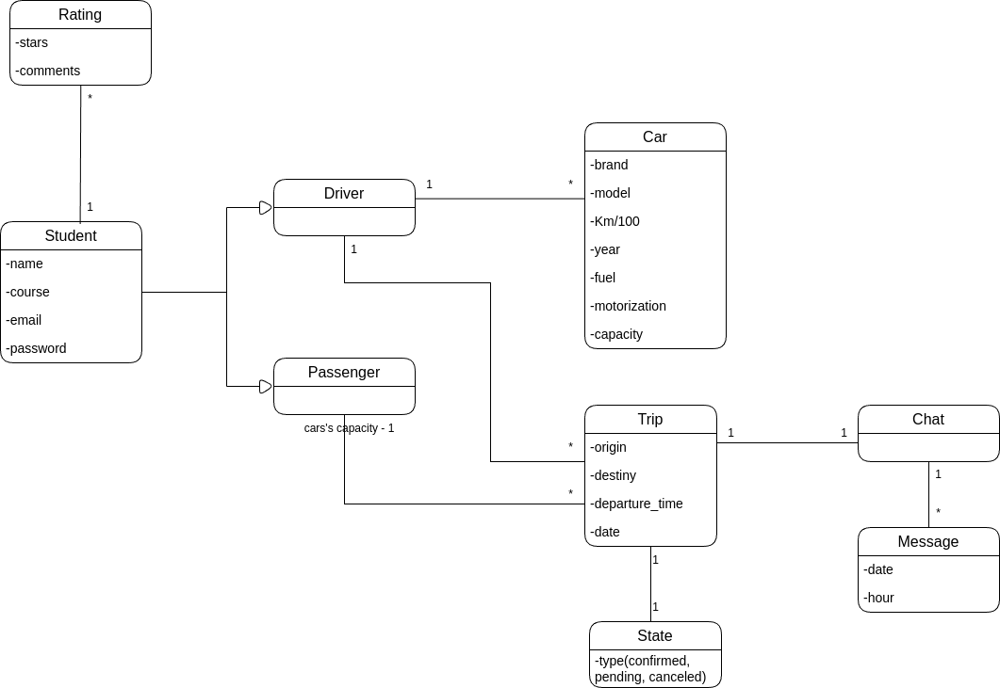
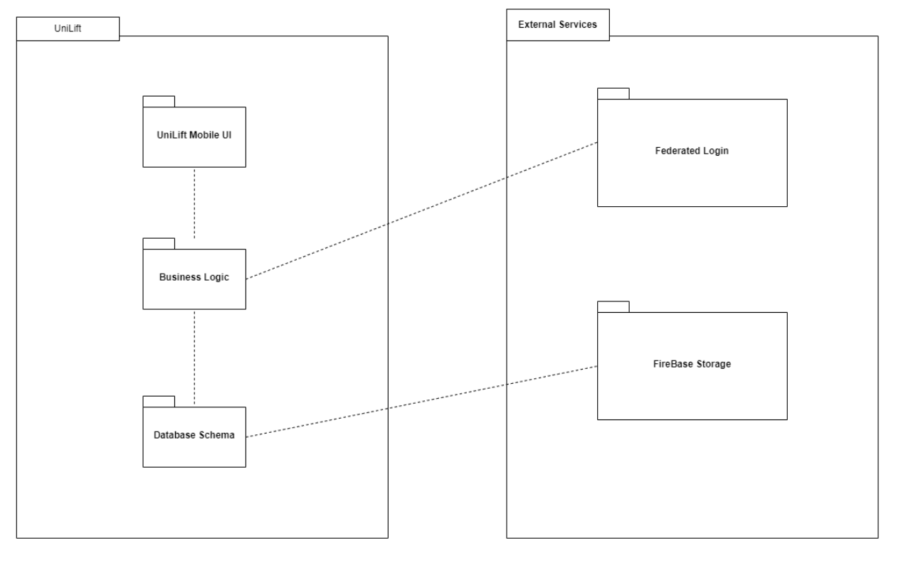
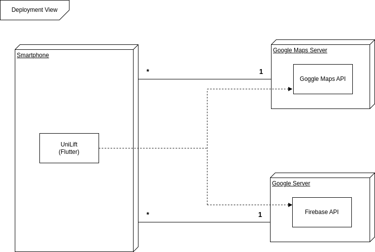
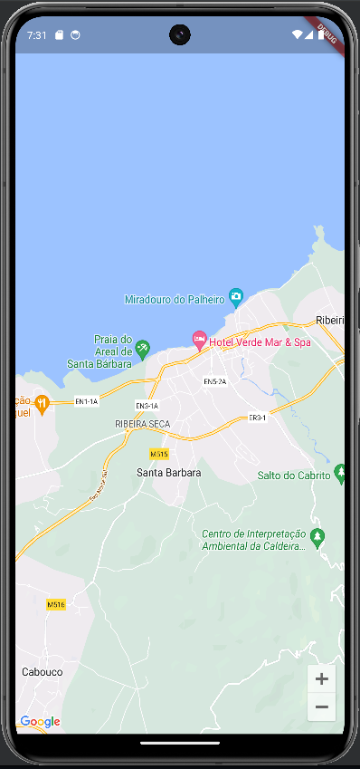

# 2LEIC03T5

# UniLift Development Report

Welcome to the documentation pages of UniLift !

You can find here details about UniLif, from a high-level vision to low-level implementation decisions, a kind of Software Development Report, organized by type of activities:
* [Business modeling](#Business-Modelling) 
  * [Product Vision](#Product-Vision)
  * [Features and Assumptions](#Features-and-Assumptions)
  * [Elevator Pitch](#Elevator-pitch)
* [Requirements](#Requirements)
  * [User stories](#User-stories)
  * [Domain model](#Domain-model)
* [Architecture and Design](#Architecture-And-Design)
  * [Logical architecture](#Logical-Architecture)
  * [Physical architecture](#Physical-Architecture)
  * [Vertical prototype](#Vertical-Prototype)
* [Project management](#Project-Management)

Contributions are expected to be made exclusively by the initial team, but we may open them to the community, after the course, in all areas and topics: requirements, technologies, development, experimentation, testing, etc.

Please contact us!

Thank you!

* Ana Baptista - up202207334
* Bernardo Sousa - up202206009
* Eduardo Santos - up202207521
* Martim Moniz - up202206958
* Pedro Pedro - up202206961
 
## Business Modelling

### Product Vision
<Product Vision > 
For students who want to travel sustainably and comfortably to college, UniLift is a ridesharing platform that simplifies the process of sharing rides among students.

### Features and Assumptions

* Create trips
* List trips
* Reserve seat 
* Trip chats
* Cancel trip
* Create profile 
* Rate profile
* Register with college e-mail

### Elevator Pitch

Imagine an easy and safe way for college students to get around town: meet **UniLift**! UniLift is more than just a carpooling app, it's an **exclusive community for college students** to connect with others **to share rides**.

With UniLift, you can forget about waiting for crowded buses or dealing with expensive parking. Simply **open the app**, **input your route**, and **find other students heading in the same direction**. It's a convenient way to **save time**, **money**, and, of course, **reduce your carbon footprint**.

And the best part? UniLift is designed with student safety in mind. **All users are verified as college students**, and you can see reviews from other colleagues before deciding on your ride.

Join the UniLift community and be part of a smarter, friendlier way to get around town.

## Requirements

<Domain Model and Descritive text>
 
### Domain Model

  

The student is characterized by their name, course, email, and password. They can assume two distinct roles: driver or passenger. As a driver, they will be associated with one or more cars, containing information such as brand, model, fuel consumption per kilometer, year of manufacture, type of fuel (gasoline, diesel, electric), engine, and capacity. As a passenger, they can search for trips that meet their needs.

As a driver, the user has the ability to create a trip, specifying origin, destination, departure time, and date. Each trip includes a chat where all members can communicate and make agreements, with the trip status being confirmed, pending, or canceled.

## Architecture and Design 

### Logical Architecture

  

### Physical Architecture

  

### Vertical prototype

  

## Project management

You can find below information and references related with the project management in our team: 

* Backlog management: Product backlog and Iteration backlog in a [github projects board](https://github.com/orgs/FEUP-LEIC-ES-2023-24/projects/28/views/1) ;
* Release management: 
  * [v0.0]
   

* Sprint planning and retrospectives::

## Iteration 0

### Plans:

### Development Board

Beginning

End

### Retrospectives: 

This iteration does not introduce any new functionalities to the application. It serves as a vertical prototype aimed at testing the compatibility and effectiveness of various technologies for UniLift's intended purpose.  

 

## Iteration 1

### Plans:

### Development Board

Beginning

End

### Retrospectives:

As we started working on the app, we focused our first iteration on learning the basics of the flutter engine, implementing the first pages.
We have already developed the following pages: Login, Create Account, Profile and Lift Page.  
In this iteration, we also:
- Explored and implemented the basic structure of navigation between pages;
- Learned and applied fundamental Flutter concepts such as widgets, layouts, and state management;
- Began to understand the overall architecture of the application and how each page integrates into the user flow.  

 
